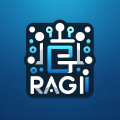

## RAG

## Introduction

Welcome to RAGI, a nimble framework developed to expedite the iteration, development, and deployment of cognitive-centric bots, agents, or models. At the core of RAGI lies the innovative use of LangChain, enabling fluid interaction with an array of public LLMs, such as ChatGPT and Claude, alongside tailored models. Our framework excels at leveraging Retrieval-Augmented Generation (RAG) to imbue LLM outputs with targeted, contemporary information, enriching the responses without altering the original model. This approach ensures delivery of contextually accurate and current insights, particularly beneficial in sectors like finance where decision-making is paramount.

## Toward a Cognitive Architecture

RAGI is not just about processing information—it's about creating a system that emulates human cognition. We're building towards an architecture that understands, learns, and reasons, bringing a new level of intelligence to automated decision-making.

## Demo

Witness RAG's capabilities through our prototype chat agent that utilizes the framework to:
- Accept and parse documents.
- Persist document data into FAISS Vector DB.
- Generate specialized prompts for risk analysis.
- Maintain conversational context with chat history.
- Engage interactively with users about their documents.

[Video Demo](#) *(Placeholder for video link)*

## Key Features

RAGI is designed to free engineers to focus on delivering customer value, enriched by a suite of sophisticated AI tools:

- **Extensible Hooks**: Our use of LangChain from the outset means quick starts and a standardized approach to model deployment and tooling integration. These hooks enable growth and new feature integration as requirements evolve.
- **SQL Worker**: Adds database-driven context to searches.
- **Chat History**: Maintains conversation context for coherent and pertinent dialogue.
- **Vector Store for Document Vectors**: A repository for document vectors to support advanced semantic search and clustering.
- **Document Handler**: Processes documents in real-time, extracting vital information from diverse text sources.
- **LLM Wrapper**: A versatile wrapper for various LLMs, broadening the scope of applications and customization.
- **Config Module**: Manages transitions between development and production settings smoothly.
- **Prompt Explorer**: Enhances prompt crafting for effective LLM interaction.

## Deployment

- **Docker Compose**: Jumpstart local development with Docker Compose. The provided `docker-compose.yml` launches an interactive Risk Analyst chat.
- **Kubernetes Support**: Optimized for Kubernetes, RAGI promises scalability and robustness in production environments.
- **FastAPI Integration**:
  - FastAPI powers our RESTful suite of agents, boasting speed and ease of use. Its asynchronous nature suits demanding performance needs.
  - Example API endpoints are ready to use, with EKS integration streamlining the path to production.

## Getting Started

- **Prerequisites**: Docker and Python knowledge.
- **Installation Guide**: Comprehensive setup steps for a hassle-free installation.
- **Basic Usage**: Get up and running with examples for bot interactions and document processing.

## Advanced Usage

- Instructions for framework customization and extension.
- Performance optimization strategies across industries.
- [Usage Examples](#) *(Placeholder for examples link)*

## Contribiting

Your contributions and feedback are invaluable. We've outlined guidelines to ensure framework integrity and invite enhancements, bug fixes, or documentation improvements.

---

