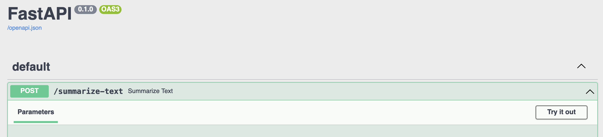

#  LLM-API-starterkit

This repository serves as a lightweight beta model deployment framework designed to facilitate easy and efficient deployment of machine learning models. It provides wrapped access to features such as chat history, databases, sessions, authentication, an LLM (Large Language Model), and a file parsing model. Developed with a focus on agility and integrability, the framework works out of the box with an OpenAI key and integrates seamlessly with langchain, allowing for rapid enhancements with new GPTs and LLMs. Whether you are looking to deploy a model quickly or build a custom solution with various utilities, this framework offers a solid starting point.

##  Quick-start

There's three steps to starting the demo or starting development with this template.

1. Installation of general python package requirements/dependencies
2. Selection of LLM model & dependencies
3. Running the FastAPI application

##  API Keys

##  Run Local 


## Test
`pytest tests/your_test_file.py`
##  Access from Inscribe App

##  Features 
 - FAISS
 - Unstructured PDF Parser
 - SQL Agent
 - OpenAI LLM 
 - SageMaker Model
 - Chat History
 - Authentication
 - Session managment
 - Prompt Engineer

##  Creating your own Model, chatBot or Agent


##  Production


## # 1. Installation of dependencies

Installing dependencies in a Python project is typically done using the `pip install` command along with a requirements.txt file. This file contains a list of packages needed for the project, specifying versions to ensure compatibility.

It is highly recommended to install these dependencies within a virtual environment. A virtual environment is an isolated Python runtime environment that allows you to manage dependencies for different projects separately without running into version conflicts. It's one of the best practices in Python development because it helps maintain your system's integrity and ensures reproducible builds.

To set up a virtual environment and install the required packages, follow these steps:

Tutorial was created using `Python 3.10`.

```bash
pip install -r requirements.txt
```

1. Install the `virtualenv` package globally (if not already installed):
```bash
pip install virtualenv
```

2. Navigate to the project directory where you want to create the virtual environment.

3. Create a virtual environment named 'venv' (you can choose any name):
```bash
python3 -m venv venv
```

4. Activate the virtual environment:
On macOS and Linux:
```bash
source venv/bin/activate
```
On Windows:
```bash
call venv\Scripts\activate
```

5. With the virtual environment activated, install the dependencies from requirements.txt:
```bash
pip install -r requirements.txt
```
```bash
python3 -m venv venv
. venv/bin/activate
pip install -r requirements.txt
```

Ideally, we use dependency management with `poetry` for a smoother experience (see [https://github.com/tleers/minimal-serverless-llm-deployment](https://github.com/tleers/serverless-llm-app-factory) for an example). We ignore this additional complexity for now in this example.

## # 2. LLM model preparation

LLM stands for Large Language Model, which is an advanced Artificial Intelligence model capable of understanding and generating natural language. LLMs are essential for a variety of Natural Language Processing (NLP) tasks such as translation, question-answering, and conversation simulations. In the context of our deployment framework, we use LLMs to process and interact with user inputs, providing intelligent and contextually relevant responses.

Before using an LLM, you must ensure the model is properly set up with the necessary API keys and configurations. This typically involves the following steps:

## ## 2.1 **With an OpenAI key**

1. Rename the `.env.example` file to `.env`. This can be done with the following command on UNIX-based systems (including Linux and macOS):
```bash
mv .env.example .env
```
On Windows, you can use:
```cmd
rename .env.example .env
```

2. Open the newly renamed `.env` file in a text editor of your choice.

3. Locate the line that reads `OPENAI_API_KEY=` and add your OpenAI API key immediately after the equals sign so that it looks like this:
```plaintext
OPENAI_API_KEY=your_api_key_here
```

The `.env` file is used to store environment variables, which are a set of dynamic named values that can affect the way running processes will behave on a computer. In this case, it is being used to securely store the API key which is sensitive information and should not be hard-coded or checked into version control systems. Adding your OpenAI API key to the `.env` file allows the application to authenticate with the OpenAI API and use the LLM for processing requests.`

Done.

## ## 2.2 **Without an OpenAI key**

Note that you need sufficiently powerful hardware to run a local model. It's easier to use the OpenAI API if you're initially experimenting. Making an account means you get free credits, which are usually more than you need.

## ### **X86-64 architectures (Windows, Linux, non-Apple silicon Mac)**
We use LlamaCpp. 
https://python.langchain.com/en/latest/modules/models/llms/integrations/llamacpp.html

1. Download model weights that are compatible with the llamacpp implementation. 
I use vicuna 1.1 quantized https://huggingface.co/vicuna/ggml-vicuna-7b-1.1/blob/main/ggml-vic7b-uncensored-q4_0.bin, as recommended on https://old.reddit.com/r/LocalLLaMA/wiki/models

2. Make sure the model weights are in the current directory and you know the filename. 
In this tutorial, the filename is `ggml-vic7b-uncensored-q4_0.bins`

## ### **ARM64 architectures or M1/M2 Mac**
LangChain support for LLamaCpp is currently iffy on Apple Silicon. Therefore, we instead use the GPT4ALL integration.
Download the model file here:


1. Download model weights from https://gpt4all.io/index.html
There are many different ones available, take a look at what best fits your usecase. I use
"ggml-gpt4all-j-v1.3-groovy.bin"

2. Make sure the model weights are in the current directory and you know the filename. 
In this tutorial, the filename is `ggml-gpt4all-j-v1.3-groovy.bin`


## # 3. Running the FastAPI application

FastAPI is a modern, high-performance web framework for building APIs with Python 3.7+ based on standard Python type hints. It's known for its speed, ease of use, and ability to create RESTful APIs quickly with automatic interactive documentation. FastAPI is particularly suited for this Light Language Model (LLM) API as it supports asynchronous request handling and is designed for scalability, making it a good choice for machine learning applications where concurrent handling of multiple requests is commonplace.

The OpenAI API provides access to OpenAI's powerful language models, including GPT-3 and others. By interacting with this API, users can perform natural language tasks such as completion, translation, summarization, and question-answering. Its strength lies in its ability to generate human-like text and understand complex queries.

To run the application using the OpenAI API, follow these steps:
1. Make sure you have created and activated your virtual environment (as described in the installation section) and that the `.env` file contains your OpenAI API key.

2. Run the following command in the terminal from the root directory of the project:
```bash
uvicorn app.main_openai:app --port 80 --env-file .env
```

3. Open a web browser and navigate to `http://localhost:80/docs` to view the automatically generated API documentation courtesy of FastAPI and Swagger UI. Here, you have an interactive UI to send requests to the API and observe the responses.

4. Use the interactive API documentation to send requests to your LLM API. To do this, click on the endpoint you wish to test, then click 'Try it out', enter your request data, and finally hit the 'Execute' button to run the query and see the response.

With local LLM using Vicuna, compatible with X86_64 architecture
```bash
uvicorn app.main_local_lamacpp:app --port 80
```

With local LLM using GPT4All, compatible with X86_64 as well as arch_64 (mac m1, m2) architectures.
```bash
uvicorn app.main_local_gpt_4_all:app --port 80
```

Go to `https://localhost:80/docs` to see the automatically generated API documentation. 

You can also try out the summarization endpoint by clicking `Try it out!`



